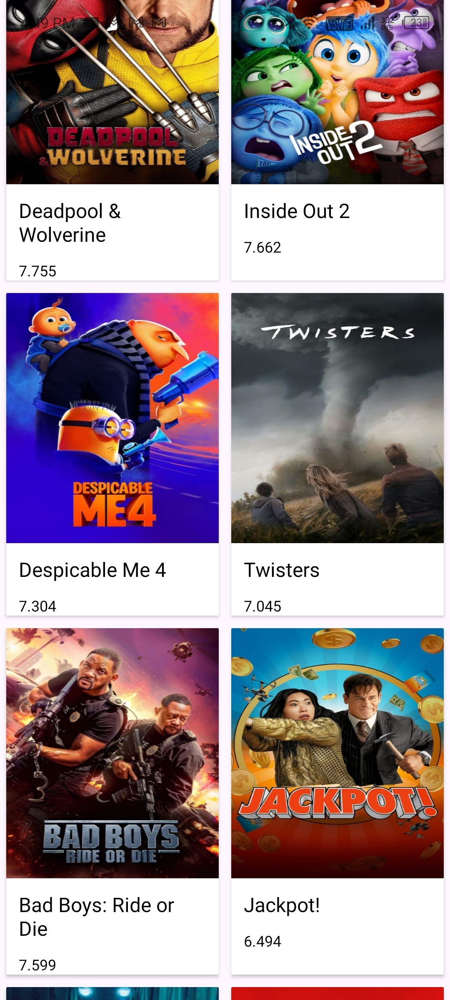

# MoviesApp 🎬

MoviesApp is an Android project designed to practice working with APIs, Retrofit, and MVVM architecture. The app fetches data of popular movies from The Movie Database (TMDb) API in JSON format, converts it into Plain Old Java Objects (POJOs), and displays it in a RecyclerView arranged in grids. Each grid item is a CardView that contains a movie poster, title, and vote average.

## Features
- **Main Screen:**
  - Displays a grid of popular movies using RecyclerView.
  - Each grid item is a CardView containing:
    - An ImageView for the movie poster
    - A TextView for the movie title
    - A TextView for the vote average
  - Data is fetched from the TMDb API and parsed into POJOs.
  
## Technologies Used
- Java
- Android Studio
- Retrofit for API calls
- MVVM (Model-View-ViewModel) Architecture
- Repository pattern
- RecyclerView with GridLayoutManager
- CardView
- ImageView and TextView
- POJO (Plain Old Java Object)

## Screenshots
- **Main Screen:**

  

## How to Run
1. Clone the repository: `git clone https://github.com/kaifali744/MoviesApp.git`
2. Open in Android Studio
3. Obtain an API key from [The Movie Database (TMDb)](https://www.themoviedb.org/) and add it to the project.
4. Build and run on an emulator or physical device

## Connect with Me
- [Twitter](https://x.com/kaifali744)
- [LinkedIn](https://www.linkedin.com/in/mohammad-kaif-ali-3a19671a0/)

